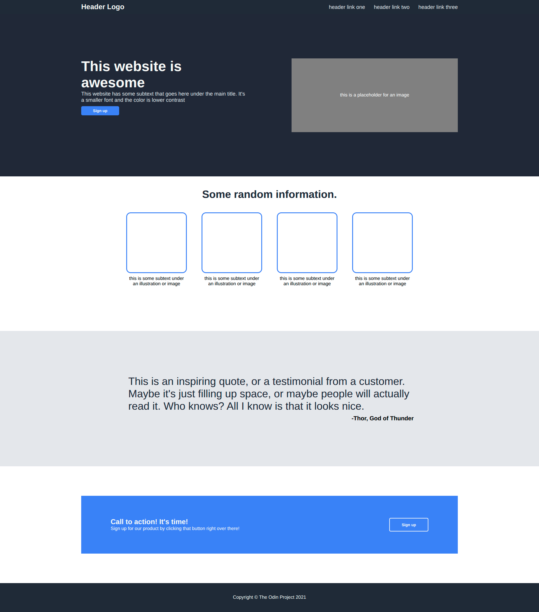

# Landing Page - The Odin Project

This is a solution to the [Landing Page project](https://www.theodinproject.com/lessons/foundations-landing-page) from The Odin Project's Foundations curriculum.

## 📸 Screenshot

## 🔗 Links

- **Live Preview:** [Click here to see the live demo](https://tetrisy.github.io/odin-landing-page/)

## 🧐 About The Project

The goal of this project was to replicate a provided design mockup using only HTML and CSS. The main focus was to practice using **Flexbox** to position elements, rather than relying on floats or standard block positioning.

The webpage consists of:

1.  **Header:** Logo and navigation links.
2.  **Hero Section:** Main title, subtext, button, and a placeholder image.
3.  **Information Section:** Four cards with illustrations and text.
4.  **Quote Section:** A styled blockquote with an author attribution.
5.  **Call to Action:** A modal-like container with a button.
6.  **Footer:** Simple copyright text.

### Built With

- HTML5
- CSS3
- Flexbox

## 💡 What I Learned

This project was a great way to solidify my understanding of CSS layout mechanics. Here are a few specific things I learned:

- **Flexbox Containers:** I learned how to use `display: flex`, `justify-content`, and `align-items` to center content perfectly.
- **CSS Reset:** I realized the importance of removing default browser margins and padding to get the layout to look exactly like the design.
- **The "Gap" property:** Using `gap` in flex containers made spacing items much easier than using individual margins.
- **Structuring HTML:** I learned how to group elements into `div` containers to control how they move when the window resizes and to fix the problem of stretching too much when used on ultrawide monitors.

## 👏 Credits

- Design idea and curriculum provided by [The Odin Project](https://www.theodinproject.com/).
